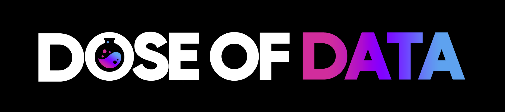
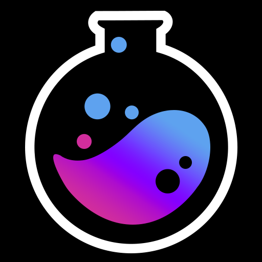

# Event Host Guidelines
Are you considering hosting a an event with one of our instructors on your server? We're excited to collaborate with you! To ensure that your event is a success, based on our experience running online instruction events, we've put together a suggested checklist of tasks that will help you organize and run your event seamlessly.

Our checklist covers all the important aspects of hosting a live instruction event, from briefing your guests on our backgrounds to preparing a contingency plan for potential issues. We recommend that you review these guidelines carefully to minimize potential issues and ensure a smooth, engaging event for all participants.

In addition to our comprehensive checklist, we also provide branding and graphic assets to help you promote your event and make it stand out. We'll provide you with everything you need to create an eye-catching online presence that will attract attendees from far and wide.

And after your event, our post-event follow-up checklist will help you gather feedback from your attendees, share event recordings and summaries, and easy to follow-up tasks for everyone who participated.

So, if you're considering hosting a Dose of Data event on your server, keep these guidelines in mind to make your event a success. We're excited to collaborate with you and bring the magic of data to your community!

No. | Task                                               | Description                                               | Responsibilities | Event Timeline
--- | -------------------------------------------------- | --------------------------------------------------------- | ---------------- | --------------
| 1   | Guest background brief copy                        | Copy of guest's background information                     | Guest            | Before event
| 2   | Guest branding assets                              | Branding materials from guest (logo, images, etc)           | Guest            | Before event
| 3   | Event description                                  | Description and details of the event                       | Guest, Host      | Before event
| 4   | Event Graphic assets                               | Event graphics and branding materials                      | Host             | Before event
| 5   | Event graphic sign-off                             | Approval of event graphics                                 | Guest            | Before event
| 6   | Moderator Strategy                                 | Plan for moderator's role during event                      | Host             | Before event
| 7   | Soundcheck and Technical Setup                     | Check technical details for smooth running of event         | Host, Guest      | Before event
| | 7.1 Event recording functionality                      | Ensure event recording is working properly                  | Host             | Before event
| | 7.2 Network speed test                                 | Test network speed for reliable connection                   | Guest, Host      | Before event
| | 7.3 Echo or sound feedback check                       | Check for sound feedback or echo issues                     | Host, Guest      | Before event
| | 7.4 Microphone and audio quality check                  | Test microphone and audio quality                           | Host, Guest      | Before event
| | 7.5 Video quality check                                | Test video quality (if applicable)                          | Host, Guest      | Before event
| 8   | User event onboarding checklist creation            | Create checklist for attendees to ensure smooth onboarding.  Invite yourself as a user from off and on Discord (on and off the server) or the hosting platform and verify each step that a user must finish in order to successfully attend the event.   | Host             | Before event
| 9 | Event promotion and audience outreach               | Promote event and reach out to potential audience            | Guest, Host      | Before and during event
| 10  | Event agenda and format planning                    | Plan event agenda and format                                | Guest, Host      | Before event
| 11  | Q&A session preparation                            | Prepare for Q&A session                                     | Guest, Host      | During event
| | 11.1 Collect questions in advance                        | Collect questions from attendees in advance (optional)                 | Host             | During event
| | 11.2 Plan for live questions                             | Plan how live questions will be handled                      | Host             | During event
| | 11.3 Set rules for question submission                   | Set rules for how questions can be submitted                | Host             | During event
| 12  | Contingency planning                                | Plan for potential issues or problems                        | Host, Guest      | Before and during event
| | 12.1 Backup audio and video equipment                    | Have backup equipment in case of technical issues           | Host, Guest      | Before and during event
| | 12.2 Alternative means of communication                  | Have alternative means of communication in case of network issues | Host | Before and during event
| | 12.3 Backup host or guest                                | Identify potential backup hosts or guests                    | Host             | Before and during event
| 13  | Post-event follow-up                                | Follow up with attendees and gather feedback                 | Host             | After event
| | 13.1 Share event recordings and summaries                | Share event recordings and summaries                         | Host             | After event
| | 13.2 Gather feedback and insights from attendees         | Collect feedback and insights from attendees                | Host             | After event
| | 13.3 Thank the guest and attendees                       | Express gratitude to the guest and attendees.  Post any links to mateirals used and reocmmended readings.                | Host             | After event

## Dose of Data Branding Assets

## Social Media Links
TBD

## Canva Event Template
https://www.canva.com/design/DAFceOlNRaA/7idZ7F4UwafG7-48RwMLgw/edit?utm_content=DAFceOlNRaA&utm_campaign=designshare&utm_medium=link2&utm_source=sharebutton
